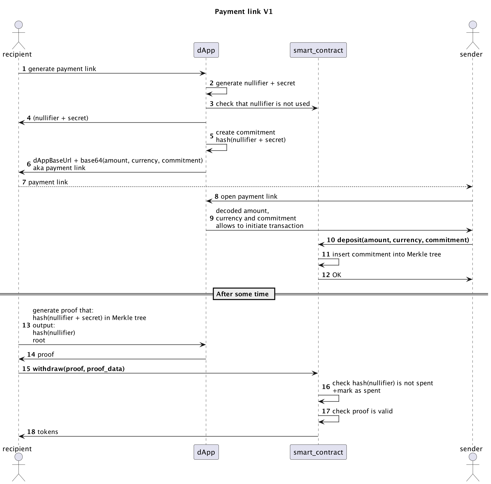

# Easy private payments protocol

Right now to send someone money you need to know the address of the recipient. If you are a recipient of the money you
may feel not comfortable sharing your wallet address with another person, as:

- it allows another person, with whom you are sharing the address, to make a connection between your wallet address and
  your identity
- it exposes all your financial history to the person you are sharing your address with (what tokens you hold and how
  much of these tokens you hold, where you invested, what NFT you bought or sold, from where you receive money, etc.)

There are protocols that also try to solve payment privacy problems.  
For example, AZTEC is focusing on hiding the transaction amounts, Tornado.Cash is focusing on hiding the origin of the
money, and Tornado Nova has shielded transactions, but to initiate it recipient needs to be registered in the pool and
share his wallet address.

This payment protocol is focusing on hiding the recipient's address and, as result, hiding all financial history from
the sender.  
You could say that you can achieve the same with just the creation of a new address, and it’s partially true, while it
solves the problem of hiding financial history it creates other problems:

- you need some native tokens in this wallet to be able to do something
- if you move tokens to your main wallet without going to the mixer - the sender would still be able to make the
  connection

## How it works


## Build the project

```
yarn
yarn run circuit:build
yarn run build
```

## Run smart contract tests

```
yarn run test
```

## Build frontend

```
cd frontend && yarn
rm -rf ./src/contracts && cp -r ../artifacts/contracts ./src
```

## Start app locally

Start local blockchain:

```
npx hardhat node
```

Deploy smart contracts

```
npx hardhat run scripts/deploy.ts --network localhost
```

Copy addresses of token and contract to `./frontend/utils/constants.ts`

Start local frontend
```
cd frontend && yarn dev
```